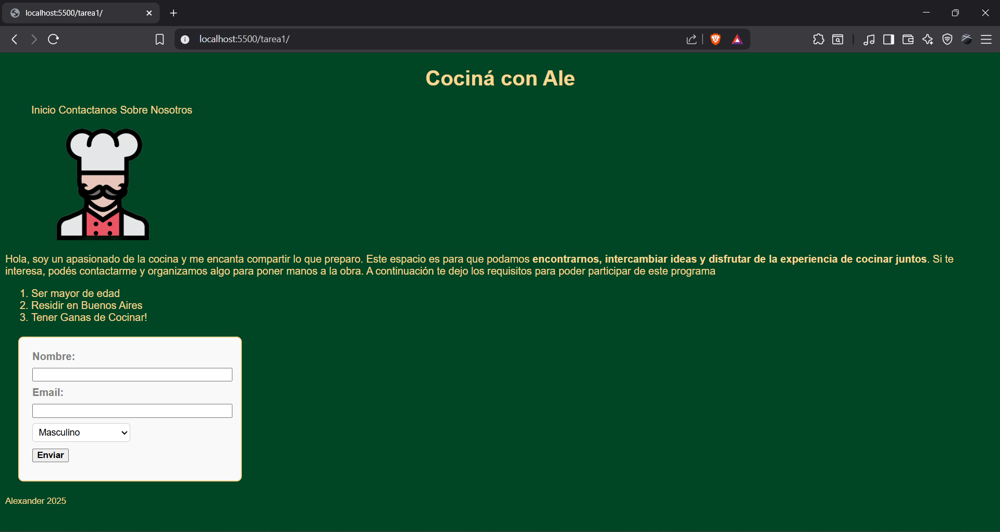

# Tarea 1 - Antes de React

## 📖 Descripción
Este proyecto consiste en una página web sencilla desarrollada con **HTML** y **CSS**, que incluye una estructura básica y estilos iniciales.  
El objetivo es aplicar los conceptos vistos en clase y practicar la creación de una página desde cero.


## 🚀 Instrucciones de instalación y uso

1. Clonar este repositorio en tu computadora:
   ```bash
   git clone https://github.com/Litovchenko05/Desarrollo-en-React-JS.git

2. Abrir la carpeta del proyecto en **Visual Studio Code**.
     
3. Instalar la extensión **Live Server** (si no la tenés).
     
4. Dar clic derecho en el archivo `index.html` y seleccionar **"Open with Live Server"**.
     
5. El navegador se abrirá mostrando la página.
   


## 👩‍💻 Créditos

Autor: Alexander Litovchenko

Curso: Diplomatura Professional Full-Stack Developer

Unidad: M1 U1 - Antes de React