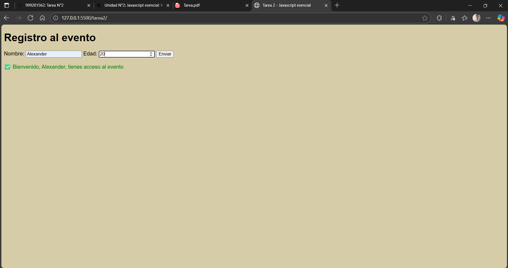
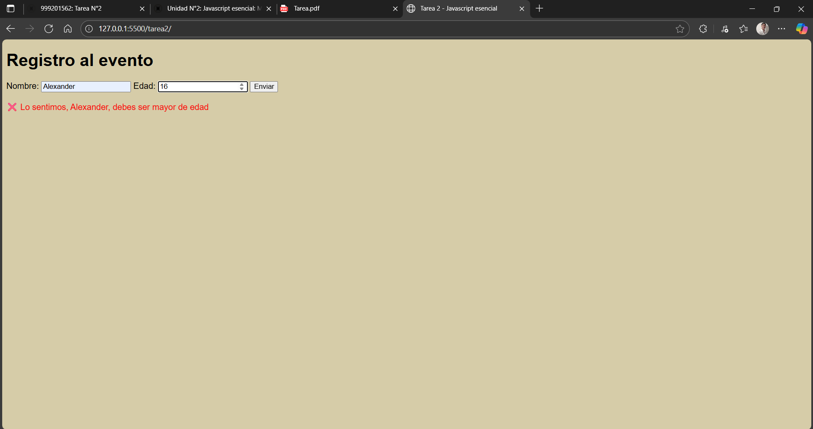

# Tarea 2 - Javascript esencial

## 📖 Descripción
El objetivo de este proyecto consiste en practicar la declaración de variables (let, const), el uso de operadores, 
funciones, DOM y eventos con el desarrollo de un pequeño formulario que valide datos y muestre un 
mensaje dinámicamente. 

## 🚀 Instrucciones de instalación y uso

1. Clonar este repositorio en tu computadora:
   ```bash
   git clone https://github.com/Litovchenko05/Desarrollo-en-React-JS.git

2. Abrir la carpeta del proyecto en **Visual Studio Code**.
     
3. Instalar la extensión **Live Server** (si no la tenés).
     
4. Dar clic derecho en el archivo `index.html` y seleccionar **"Open with Live Server"**.
     
5. El navegador se abrirá mostrando la página.
   




## 👩‍💻 Créditos

Autor: Alexander Litovchenko

Curso: Diplomatura Professional Full-Stack Developer

Unidad: M1 U2 - Javascript esencial