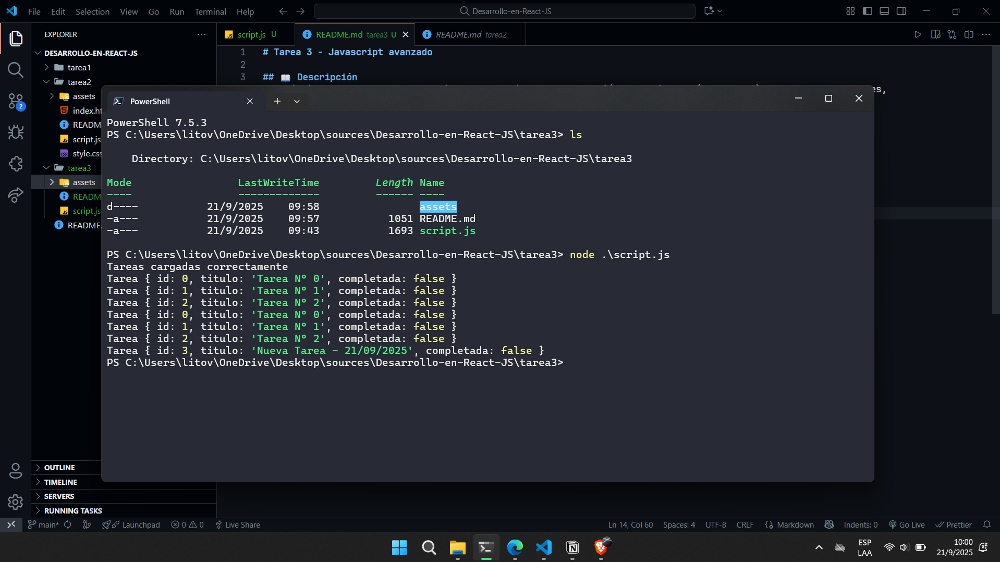

# Tarea 3 - Javascript avanzado

## 📖 Descripción
El objetivo de este proyecto consiste en practicar el uso, mediante la creacion de un script de un flujo de carga de tareas la utilización de setTimeout y Promise para simular asincronía, la creación de clases con propiedades y métodos y la manipulación de datos con map, filter y find.

## 📦 Requisitos

- [Git](https://git-scm.com/) instalado en tu PC
- [Node.js](https://nodejs.org/) (recomendable versión LTS)

## 🚀 Instrucciones de instalación y uso

1. Clonar este repositorio en tu computadora:
   ```bash
   git clone https://github.com/Litovchenko05/Desarrollo-en-React-JS.git

2. Entrar a la carpeta del proyecto
   ```bash
   cd Desarrollo-en-React-JS\tarea3
     
3. Ejecutar el archivo JavaScript
   ```bash
   node .\script.js
   


## 👩‍💻 Créditos

Autor: Alexander Litovchenko

Curso: Diplomatura Professional Full-Stack Developer

Unidad: M1 U3 - Javascript avanzado